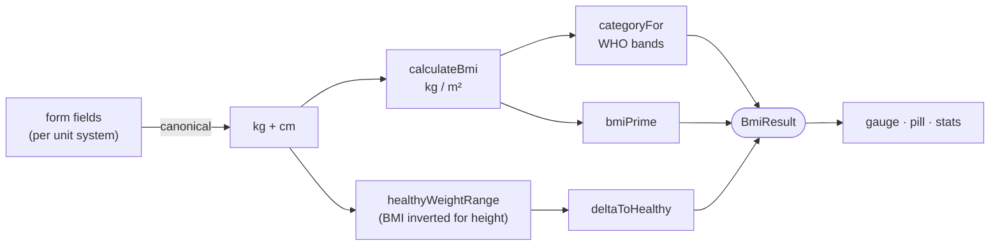

# BMI Calculator

> **🔗 Live: https://bmi-calculator-eight-rose.vercel.app**

A Body Mass Index calculator built with **React 19 + TypeScript + Vite**. It goes past the
usual one-number output: WHO category bands, a hand-built SVG gauge showing exactly where you
fall, the healthy weight range **for your height**, how far outside it you are, and a saved
history — with lossless switching between metric and imperial.

## Features

- **Live BMI** as you type, with the WHO band (Underweight → Obesity class III) colour-coded.
- **Hand-built SVG gauge** spanning BMI 15–40, with the category bands drawn to scale and an
  animated marker at your value. No charting library.
- **Healthy weight range for your height** — the BMI formula inverted — plus a plain-language
  delta ("18.7 kg above the healthy range").
- **Metric ↔ imperial** that carries your numbers across instead of clearing them: 175 cm /
  70 kg becomes 5′8.9″ / 154.3 lb and the BMI stays identical.
- **BMI Prime** (ratio to the healthy upper bound of 25).
- **History** of saved readings in `localStorage`, synced across tabs.
- **Tested core** — 28 Vitest cases covering conversions and every WHO boundary.

## The logic

All the maths lives in [`src/lib/bmi.ts`](src/lib/bmi.ts) as pure functions, which is what makes
the fiddly parts testable — the classification boundaries and the healthy-range inversion.



`healthyWeightRange` is the interesting one: rather than classifying a BMI, it solves the
formula backwards for a fixed height, giving the weight band that lands in 18.5–24.9. The tests
assert the round-trip — both returned bounds classify back as `normal`.

## Architecture

```
src/
├── types.ts            UnitSystem, BmiCategory, BmiResult, HistoryEntry
├── constants.ts        WHO bands + colours, healthy band, gauge span
├── lib/
│   ├── bmi.ts          ← conversions + BMI maths (pure)
│   ├── bmi.test.ts     ← 28 Vitest cases
│   └── format.ts       unit-aware display formatting
├── hooks/
│   ├── useMeasurements.ts   form state + lossless unit switching
│   ├── useHistory.ts        saved readings (capped)
│   └── useLocalStorage.ts   persisted state, cross-tab synced
└── components/         UnitToggle · MeasurementForm · BmiGauge · ResultCard · HistoryList
```

## Getting started

```bash
npm install
npm run dev      # http://localhost:5177
npm test         # 28 unit tests
npm run build    # type-check + production build
```

> **Node** is installed via [nvm](https://github.com/nvm-sh/nvm); run `nvm use --lts` if
> `node`/`npm` aren't found.

## A note on BMI

BMI is a **population screening tool, not a diagnosis**. It can't distinguish muscle from fat
and doesn't account for age, sex, ethnicity, or body composition — muscular athletes routinely
classify as "overweight", and it is known to be less predictive for some ethnic groups. This
project is a maths and UI exercise, not medical advice.
