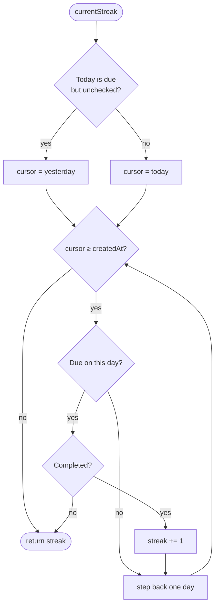
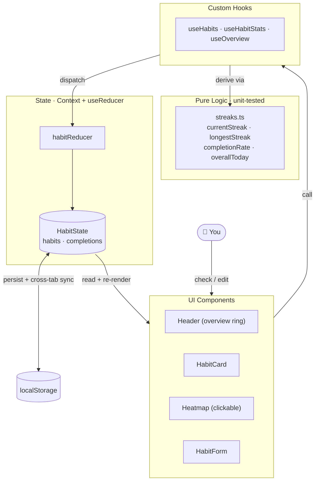

# Interactive Habit Tracker

A habit tracker that goes beyond a to-do list — built with **React 19 + TypeScript + Vite**.
The interesting part isn't the checkboxes, it's the **logic**: schedule-aware **streaks**,
dynamic **completion percentages**, and a clickable contribution **heatmap**, all driven by
pure, unit-tested functions.

## Features

- **Streaks that understand schedules** — current and longest streaks count only the days a
  habit is actually *due*. A weekday-only habit doesn't break its streak over the weekend, and
  an unchecked-but-not-over **today** gets a grace period instead of resetting you to zero.
- **Dynamic completion %** — a rolling 30-day consistency ring per habit, plus a board-wide
  "today" ring and streak aggregates in the header.
- **Interactive heatmap** — a GitHub-style grid of the last 18 weeks. Completed days glow in the
  habit's colour, missed due-days read as empty, rest days are faint. Click any day to toggle it.
- **Flexible scheduling** — every day, weekdays, weekends, or any custom set of weekdays.
- **Full CRUD** — add/edit habits with an emoji, colour, and schedule picker; archive or delete.
- **Persistence** — everything is saved to `localStorage` and synced across browser tabs.
- **Tested core** — the streak/percentage engine ships with a Vitest suite (`npm test`).

## The logic

All the math lives in [`src/utils/streaks.ts`](src/utils/streaks.ts) as pure functions of
`(habit, completions, today)` — which is exactly why it's easy to test. The current-streak
walk, including the schedule-skip and the "today" grace period:



## Architecture

Normalised state (`habits` + `completions` maps) lives in a `useReducer` + Context store.
Components read and act through custom hooks; the hooks lean on the pure engine for every
derived number.



```
src/
├── types.ts                 Habit, HabitState, Weekday
├── constants.ts             colours, emojis, schedule presets
├── utils/
│   ├── date.ts              ISO "yyyy-mm-dd" helpers (timezone-stable)
│   ├── streaks.ts           ← core engine (pure functions)
│   ├── streaks.test.ts      ← 12 Vitest cases
│   └── schedule.ts          schedule labels & weekday toggles
├── data/seed.ts             realistic demo habits + history
├── state/                   actions · habitReducer · HabitContext
├── hooks/                   useHabits · useHabitStats · useOverview · useLocalStorage
└── components/              Header · HabitCard · ProgressRing · Heatmap · HabitForm · EmptyState
```

## Getting started

```bash
npm install
npm run dev      # http://localhost:5174
npm test         # run the streak-engine unit tests
npm run build    # type-check + production build
```

> **Note:** Node is installed via `nvm` on this machine. If `node`/`npm` aren't found in a fresh
> terminal, run `nvm use --lts` (or open a new shell so `~/.zshrc` loads nvm).

### Running in WebStorm

1. **Open** this folder; WebStorm auto-detects the nvm Node interpreter.
2. Use the **npm** tool window (or the ▶ gutter icons) to run `dev`, `test`, or `build`.
3. WebStorm has first-class **Vitest** support — right-click `streaks.test.ts` → *Run* to see the
   green checks, or run individual cases from the gutter.
4. Open `http://localhost:5174` from the run console.

## Try it

- Click **Mark today done** and watch the ring, streak, and header update instantly.
- Click squares in the **heatmap** to backfill or undo past days — every number recomputes.
- Add a **Weekdays** habit and note its heatmap shows weekend gaps and its streak survives them.
