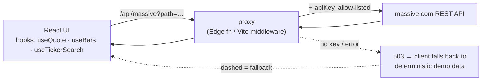

# Interactive Stocks

A stock dashboard built with **React 19 + TypeScript + Vite** that pulls live market data from
the [massive.com](https://massive.com) REST API — ticker search, a live quote, an interactive
hand-built SVG price chart with range tabs, and a saved watchlist with sparklines.

The API key is kept **server-side** behind a tiny proxy, and the app falls back to deterministic
**demo data** when no key is configured, so it always runs.

## Features

- **Search** any ticker (debounced) and see its live quote — price, $ and % change, day O/H/L,
  previous close, and volume.
- **Interactive SVG chart** with a hover crosshair + tooltip and **1W / 1M / 3M / 1Y** ranges.
  The line/area is coloured green or red by the range's overall move.
- **Watchlist** saved to `localStorage`, each row with a sparkline and live change.
- **Graceful degradation** — if there's no API key (or the API errors / rate-limits), the app
  shows clearly-labelled demo data instead of breaking.
- **Tested core** — parsers, chart geometry, and the mock generator have a Vitest suite.

## Architecture — keeping the API key safe

The browser never sees the key. It calls a same-origin `/api/massive` proxy that attaches the
key server-side and forwards an allow-listed path to massive.com. The exact same proxy logic runs
in a **Vercel Edge Function** (production) and a **Vite dev middleware** (local), so behaviour is
identical in both.



```
api/
├── _handler.ts        shared proxy logic (allow-list + key injection)
└── massive.ts         Vercel Edge Function
vite.config.ts         dev middleware mirroring the Edge fn (port 5176)
src/
├── lib/
│   ├── massive.ts     client for /api/massive
│   ├── transform.ts   response parsers + chart geometry   (tested)
│   ├── mock.ts        deterministic demo data              (tested)
│   └── format.ts      price / %, compact, dates
├── hooks/             useQuote · useBars · useTickerSearch · useWatchlist · useLocalStorage
└── components/        SearchBar · QuoteHeader · PriceChart · RangeTabs · StatGrid · Watchlist · Sparkline
```

The endpoints used are Polygon.io-compatible: `/v3/reference/tickers` (search),
`/v2/aggs/ticker/{t}/range/1/day/{from}/{to}` (bars), and
`/v2/snapshot/locale/us/markets/stocks/tickers/{t}` (quote).

## Getting started

```bash
npm install
cp .env.example .env        # then paste your key into MASSIVE_API_KEY
npm run dev                 # http://localhost:5176
npm test                    # parser + chart + mock unit tests
npm run build               # type-check + production build
```

Without a key the app runs on demo data (look for the **Demo data** badge). Add a key from your
[massive.com dashboard](https://massive.com/dashboard) to `.env` and restart to see live prices.

### Deploying to Vercel

The proxy is a zero-config Vercel Edge Function. After importing/deploying the project, add the
environment variable in **Project → Settings → Environment Variables**:

```
MASSIVE_API_KEY = <your key>
```

Redeploy and the live site serves real data. (Optionally set `MASSIVE_BASE_URL` if your dashboard
shows a different API host than `https://api.massive.com`.)

> **Note:** Node is installed via [nvm](https://github.com/nvm-sh/nvm) on this machine; run
> `nvm use --lts` if `node`/`npm` aren't found. Educational project — not investment advice.
