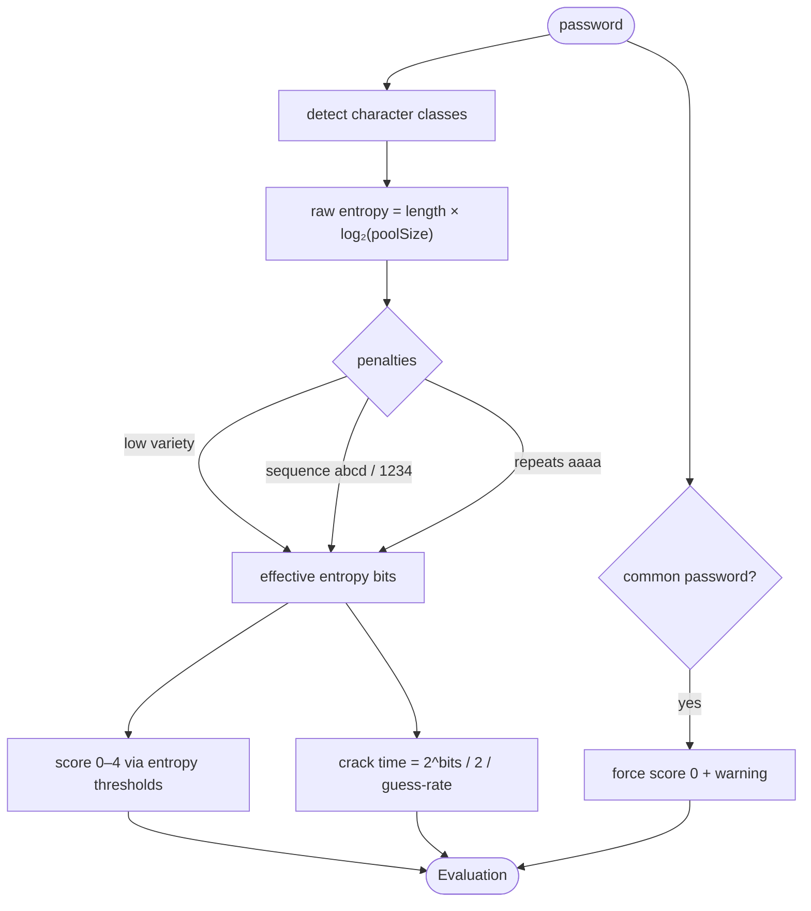

# Password Validator

A real-time password strength checker built with **React 19 + TypeScript + Vite**. It goes
beyond a requirements checklist: an **entropy-based scoring engine** that penalises predictable
patterns, an estimated **time-to-crack**, breach-style **common-password detection**, and a
cryptographically-secure **password generator** — all pure, **unit-tested** logic.

Everything runs locally in the browser; no password ever leaves the page.

## Features

- **Live strength meter** — a 0–4 score (Very weak → Very strong) with a colour-coded bar.
- **Entropy estimate** that discounts low character variety, sequences (`abcd`, `1234`, `qwerty`),
  and repeats (`aaaa`) — a naive `length × log₂(pool)` figure would overrate these.
- **Time-to-crack** estimate for an offline fast-hash attacker (`instantly` → `effectively forever`).
- **Requirement checklist** that updates as you type (length, character classes, not-common).
- **Common-password detection** against an embedded sample of the most-leaked passwords.
- **Secure generator** — `crypto.getRandomValues`, guaranteed class coverage, length slider,
  toggles, "avoid look-alikes", one-click copy, and "use this password".
- **Confirm-match** field.

## How it works

All scoring is pure functions of a single password (see [`src/utils/strength.ts`](src/utils/strength.ts)
and [`entropy.ts`](src/utils/entropy.ts)) — which is what makes it straightforward to unit-test.



## Architecture

This app intentionally has **no global store** — there's no shared cross-component state to manage,
so it uses local state + custom hooks over a pure logic core (the repo's other apps use
`Context + useReducer` where that's warranted).

```
src/
├── types.ts                 Evaluation, Rule, GeneratorOptions, …
├── constants.ts             char pools, entropy thresholds, defaults
├── data/commonPasswords.ts  embedded leaked-password sample
├── utils/
│   ├── entropy.ts           pool detection + effective-entropy estimate
│   ├── patterns.ts          repeat / sequence detectors
│   ├── strength.ts          ← evaluatePassword (the entry point)
│   ├── generator.ts         crypto-secure password generator
│   ├── format.ts            human-readable crack time
│   ├── rules.ts             the requirement checklist
│   ├── strength.test.ts     ┐ Vitest
│   └── generator.test.ts    ┘ (19 cases)
├── hooks/                   usePasswordStrength · usePasswordGenerator · useClipboard
└── components/              PasswordInput · StrengthMeter · RequirementList · Feedback · Generator
```

## Getting started

```bash
npm install
npm run dev      # http://localhost:5175
npm test         # run the 19 strength + generator unit tests
npm run build    # type-check + production build
```

> **Note:** Node is installed via [nvm](https://github.com/nvm-sh/nvm). If `node`/`npm` aren't
> found, run `nvm use --lts` (or open a fresh shell so `~/.zshrc` loads nvm).

### Running in WebStorm

Open the folder; WebStorm auto-detects the nvm Node interpreter and the npm scripts. It has
first-class **Vitest** support — right-click `strength.test.ts` → *Run* to see the green checks.

## A note on the model

The entropy/crack-time figures are a lightweight heuristic for **education and feedback**, not a
security guarantee. A production tool would use a fuller estimator like
[zxcvbn](https://github.com/dropbox/zxcvbn) and check a real breach corpus (e.g. the
[HIBP](https://haveibeenpwned.com/) k-anonymity API) — both intentionally avoided here to keep the
app dependency-free and fully offline.
