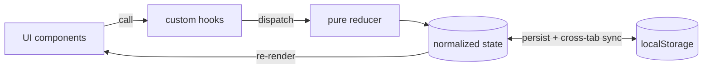

# React Projects

A collection of self-contained **React + TypeScript** apps that go a step beyond tutorials.
Each one tackles a non-trivial problem and leans into real engineering patterns: normalized
state with `useReducer`, custom hooks as a clean API layer, pure (and tested) business logic,
and accessible, hand-built UI. Most run on mock data so they start instantly; one calls a live API
behind a serverless proxy.


## Projects

Each project lives in its own folder and is fully documented in **its own README** — see there for
architecture, the complete feature list, and how to run it.

| Project | What it is | Links |
| --- | --- | --- |
| 🗂️ **Workflow Board** | A Trello-style drag-and-drop task board with a multi-user mock — switch identities, live presence, simulated collaborators, and an activity feed. | [Folder](./Workflow%20Board) · [README](./Workflow%20Board/README.md) |
| ✅ **Interactive Habit Tracker** | A habit tracker built around schedule-aware **streaks**, rolling completion **percentages**, and an interactive GitHub-style heatmap. | **[Live ↗](https://interactive-habit-tracker.vercel.app)** · [Folder](./Interactive%20Habit%20Tracker) · [README](./Interactive%20Habit%20Tracker/README.md) |
| 🔒 **Password Validator** | A real-time password strength checker — entropy-based scoring, estimated time-to-crack, common-password detection, and a crypto-secure generator. | [Folder](./Password%20Validator) · [README](./Password%20Validator/README.md) |
| 📈 **Interactive Stocks** | A market dashboard on the **massive.com** API — ticker search, an interactive SVG price chart with range tabs, and a saved watchlist. The API key stays server-side behind a proxy, with a demo-data fallback. | **[Live ↗](https://interactive-stocks-zeta.vercel.app)** · [Folder](./Interactive%20Stocks) · [README](./Interactive%20Stocks/README.md) |

## Shared approach

Every app here follows the same conventions, so they're easy to read side by side:

- **State** — `Context` + `useReducer` over a normalized store where shared state warrants it (no Redux); plain local state + hooks for simpler apps.
- **Tested logic** — the tricky parts (streaks, password entropy) are pure functions with Vitest suites.
- **Custom hooks** are the only thing components import from the state layer — never raw `dispatch`.
- **No UI libraries** — charts, modals, and drag interactions are hand-built with SVG/CSS.
- **Secrets stay server-side** — the app with a real API key proxies through a Vercel Edge Function, never shipping the key to the browser.
- **Offline-first** — state persists to `localStorage`, which doubles as live cross-tab sync.



## Getting started

Each app is a standard Vite project. To run any of them:

```bash
cd "<Project Folder>"   # e.g. "Interactive Habit Tracker"
npm install
npm run dev
```

See the project's own README for its dev port and extra scripts (tests, build).

> **Node** is installed via [nvm](https://github.com/nvm-sh/nvm). If `node`/`npm` aren't found,
> run `nvm use --lts` (or open a fresh shell so `~/.zshrc` loads nvm).

## Repository structure

```
React/
├── Workflow Board/             # Trello-style drag-and-drop board
│   └── README.md               #   ↳ its own docs
├── Interactive Habit Tracker/  # Streaks & analytics · ▲ live on Vercel
│   └── README.md               #   ↳ its own docs
├── Password Validator/         # Strength scoring + secure generator
│   └── README.md               #   ↳ its own docs
├── Interactive Stocks/         # massive.com API dashboard (Edge-fn proxy) · ▲ live on Vercel
│   └── README.md               #   ↳ its own docs
└── README.md                   # ← this overview
```

---

New projects get added as their own folder here, each with a dedicated README.
