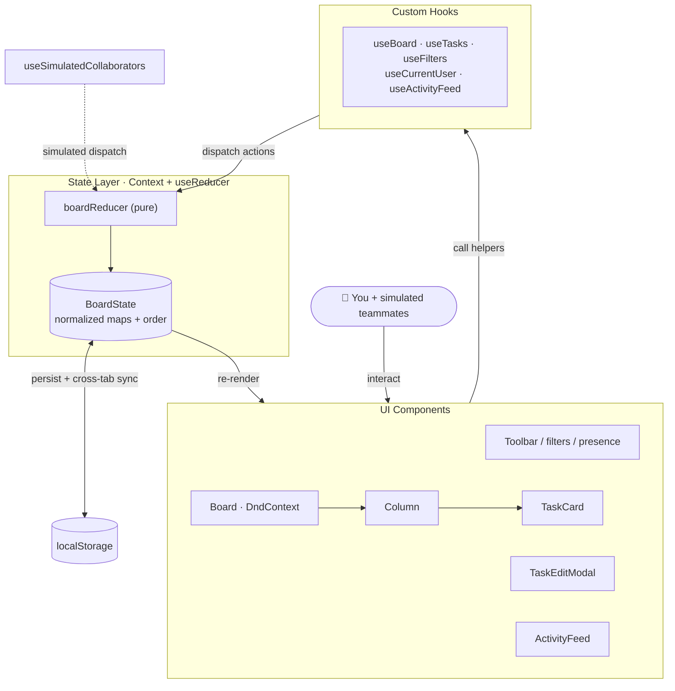
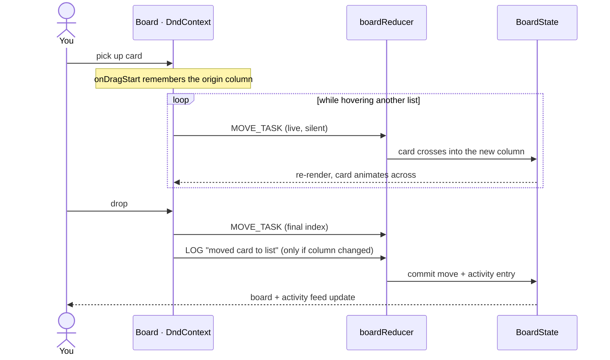

# Workflow Board

A Trello-style, drag-and-drop task board built with **React 19 + TypeScript + Vite**.
It demonstrates real state-management patterns and custom hooks behind a **multi-user
mock collaboration** experience: create, edit, move, and reorder cards across columns,
switch which teammate you're acting as, and watch simulated collaborators work the board
in real time.

## Features

- **Drag & drop** (powered by [@dnd-kit](https://dndkit.com)) — reorder cards within a
  list, move them across lists, and reorder the lists themselves. Keyboard-accessible,
  with a floating drag overlay.
- **Full card editing** — title, description, assignee, priority, multiple labels, and
  due dates (overdue dates are highlighted) in a modal.
- **Lists** — add, rename (double-click the title), delete, and set a **WIP limit** that
  turns red when exceeded.
- **Multi-user mock**
  - **Acting as** — switch your identity; new actions are attributed to you.
  - **Presence** — a live stack of online avatars.
  - **Simulate / Live** — a background engine where other teammates move cards, pick up
    work, and toggle presence on an interval, all flowing through the same reducer.
  - **Activity feed** — every action is logged with the responsible user and a relative
    timestamp.
- **Search & filter** by text, assignee, or label (`/` focuses search).
- **Persistence** — board state is saved to `localStorage` and **synced across browser
  tabs** (open two tabs, act as different people, and watch them update each other).

## Architecture

State lives in a single normalized store (`columns`, `tasks`, `users` as id-keyed maps
plus ordering arrays), driven by `useReducer` + Context. Components never dispatch raw
actions — they go through intent-named custom hooks.

### Data flow

Unidirectional: UI → custom hooks → reducer → new state → re-render. State is persisted
and synced across tabs, and the simulation engine dispatches the *same* actions as other
"users".



```
src/
├── types.ts                      Domain model (Task, Column, User, …)
├── constants.ts                  Priority metadata, storage key
├── state/
│   ├── actions.ts                Discriminated-union action types
│   ├── boardReducer.ts           Pure state transitions + auto-logged activity
│   └── BoardContext.tsx          Provider: persistence + cross-tab sync
├── hooks/                        Custom hooks (the heart of the app)
│   ├── useBoard.ts               State + memoized action creators
│   ├── useCurrentUser.ts         Identity, roster, presence
│   ├── useTasks.ts               Selectors + board stats
│   ├── useFilters.ts             Search/assignee/label filter state
│   ├── useActivityFeed.ts        Recent activity, users resolved
│   ├── useLocalStorage.ts        Generic persisted state (cross-tab)
│   └── useSimulatedCollaborators.ts   The "multiplayer" engine
├── components/                   Board, Column, TaskCard, modal, toolbar, …
├── utils/                        id / date / array / filter helpers
└── data/seed.ts                  Realistic demo board
```

### How a drag-and-drop move flows

Cross-column moves happen live during the drag (silently); a single activity entry is
logged only when the card settles in a different list.



## Getting started

```bash
npm install
npm run dev      # http://localhost:5173
npm run build    # type-check + production build
npm run lint
```

> **Note:** Node is installed via `nvm` on this machine. If `node`/`npm` aren't found in a
> fresh terminal, run `nvm use --lts` (or open a new shell so `~/.zshrc` loads nvm).

### Running in WebStorm

1. **Open** this folder as a project (WebStorm auto-detects the nvm Node interpreter under
   *Settings → Languages & Frameworks → Node.js*).
2. WebStorm reads `package.json` — use the **npm** tool window (or the gutter ▶ next to a
   script) to run `dev`, `build`, or `lint`.
3. Or add a **Run Configuration** → *npm* → script `dev`, then press ▶.
4. Open `http://localhost:5173` (WebStorm offers a one-click browser link in the run console).

## Try it

- Toggle **Simulate** and watch the board and activity feed update on their own.
- Open the app in **two browser tabs**, set a different "Acting as" user in each, and edit
  a card — the other tab updates instantly.
- Double-click a list title to rename it; use the **⋯** menu to set a WIP limit.
